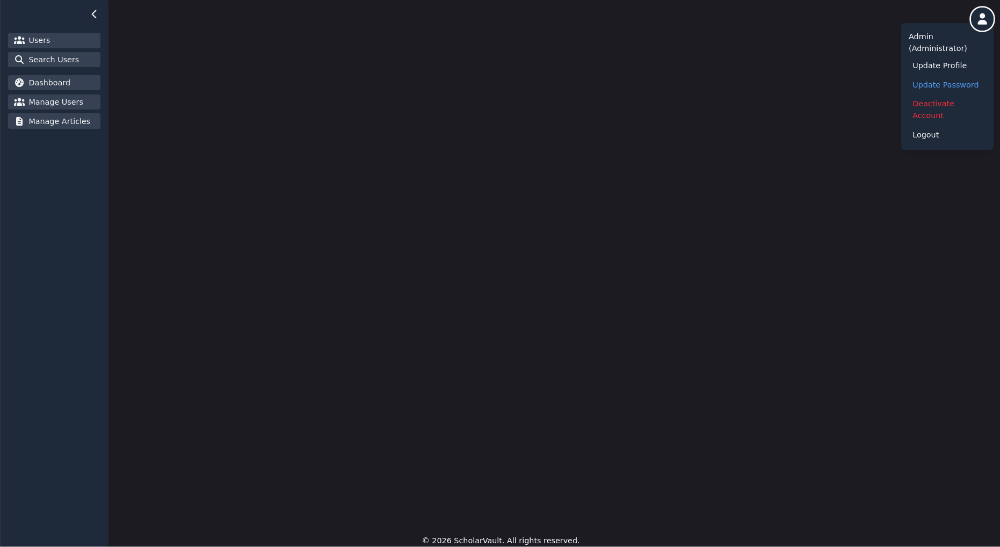
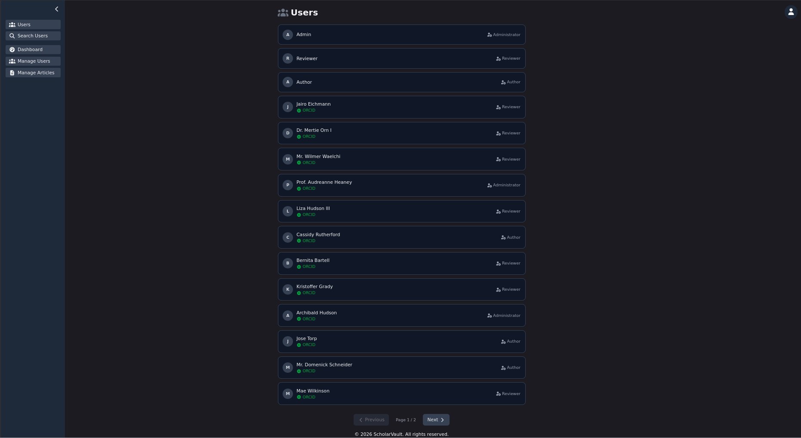
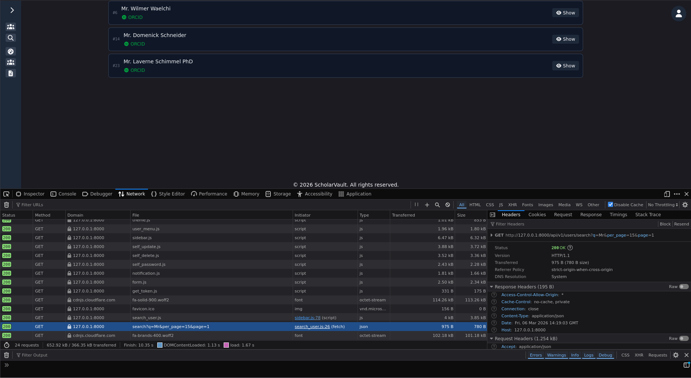
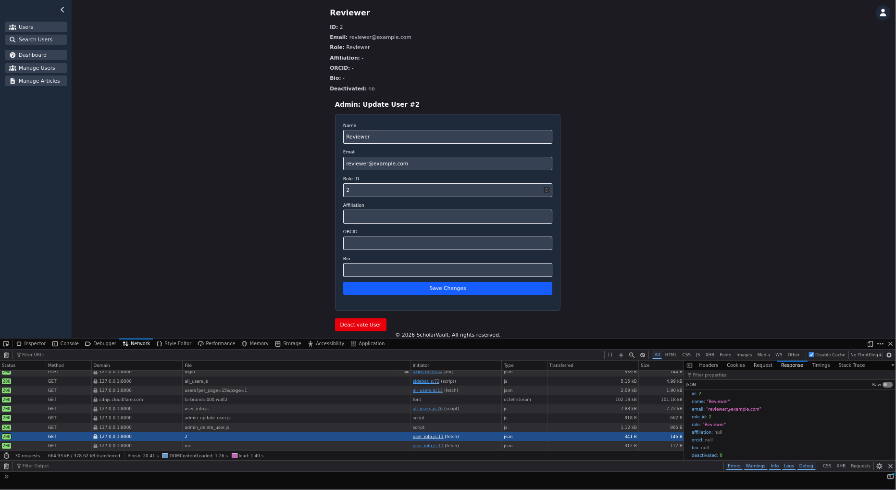

# ScholarVault
## Introduction
ScholarVault is a web based platform for publishing and managing scientific articles. It provides user account creation and management, enables authors to submit and revise articles, and allows reviewers to provide feedback to improve submissions. Administrators oversee the process and can make final decisions to publish articles.
### Motivation
There is a clear shortage of open-source, high-performance SPA (Single Page Application) engines specifically tailored for scientific publishing workflows, making ScholarVault a solution that addresses this gap efficiently.
### Technologies
**Backend: Laravel 12 API**
Laravel 12 was selected for its rapid development capabilities, robust ecosystem, built-in authentication and authorization features, and seamless support for RESTful APIs. Its expressive syntax and active community make it ideal for building a secure and maintainable backend for ScholarVault.
**Libraries used:**
* [blumilksoftware/codestyle](https://github.com/blumilksoftware/codestyle) : Enforces consistent code style and formatting across the project.
* [elegantweb/sanitizer](https://github.com/elegantweb/sanitizer) : Provides input sanitization to enhance security and prevent malicious data injection.
**Frontend: SPA with Axios, TailwindCSS, and Font Awesome**
* **Axios** is used for efficient HTTP requests and API integration.
* **TailwindCSS** allows for rapid, utility-first styling with consistent design and easy customization.
* **Font Awesome** provides a comprehensive icon library to improve UI clarity and usability.
This combination ensures a modern, performant, and maintainable frontend that aligns with the backend API for fast and interactive article management.
## Implementation
The typical workflow begins with an author registering on the platform and submitting a new article. The author can then collaborate with assigned reviewers (Administrator assigns them), addressing feedback and submitting revisions as needed. Once the review process is complete (accepted), administrators make the final decision to either publish or reject the article, ensuring quality and compliance with platform standards.
### Functionality
Home Page

#### User
Notifications:


Login Page:


Registarion Page:


Update Profile Page:

Change Password Page:

Deactivate Account Page:

All Users Page:

User Search Page:

User Creation Page (Admin version has less requirements):

Admin Controls User Controls Page:


#### Article
Published Article Page:


### Author
Submit Article Page:

My Articles Page:

My Article Details Page:

Comment Page and before revision:

After revision:

### Admin
All Articles Page:

Assign Reviewer Page:

Publish Accepted Article Page:


### Reviewer
All Assigned Articles Page:

Assigned Article Details:


### Router
#### `api.php` (API routes `/api/v1/...`)

* **Prefix:** `/api/v1`
* **Purpose:** Handles all RESTful API endpoints for authentication, users, articles, notifications, and testing utilities.

##### **Notifications**

* `/notifications/check` – GET, check new notifications
* `/notifications/read/{id}` – PATCH, mark single notification read
* `/notifications/read-all` – PATCH, mark all notifications read
* **Middleware:** `auth:sanctum`

##### **Articles**

* **Public:** `/articles/` – list and show articles
* **Author (Role::AUTHOR):**

  * Submit: `/articles/submit` – POST
  * List own articles: `/articles/my/list` – GET
  * View own article: `/articles/my/{id}` – GET
  * Comments (list/add): `/articles/my/comments/{id}` – GET/POST
  * Submit revision: `/articles/my/revision/{id}` – POST
* **Reviewer (Role::REVIEWER):**

  * Assigned articles: `/articles/assigned` – GET
  * View assigned article: `/articles/assigned/{id}` – GET
  * Comment/review: `/articles/assigned/comment/{id}` and `/articles/assigned/{id}/review` – POST
  * Make decision: `/articles/assigned/decide/{id}` – POST
* **Admin (Role::ADMINISTRATOR):**

  * List all articles: `/articles/admin/` – GET
  * List reviewers: `/articles/admin/reviewers` – GET
  * Assign reviewers: `/articles/admin/reviewers/{id}` – PATCH
  * Accept/reject: `/articles/admin/decide/{id}` – PATCH

##### **Registration & Authentication**

* `/register/` – POST, blocked if authenticated
* `/login/` – POST, blocked if authenticated
* `/login/logout` – POST, requires auth
* `/register/help` & `/login/help` – GET

##### **Users**

* Public: list, search, show
* Authenticated self: update, password change, deactivate, profile info
* Admin: create, update, deactivate

##### **Testing Utilities**

* `/test/` – GET index
* `/test/sanitization` – POST test middleware

#### `web.php` (SPA entry point)

* **Purpose:** Serves the SPA page at `/`
* **Route:** `Route::get("/", fn() => view("spa"));`
* **Note:** All client-side routing handled by the SPA; API calls go through `/api/v1/...`.

#### Conclusion

1. **API-first design:** All data operations via `/api/v1` with proper role-based access.
2. **SPA serving:** Single route for front-end with client-side routing.
3. **Scalability:** Role-specific middleware isolates permissions cleanly.
4. **Maintainability:** Clear endpoint grouping (`author`, `reviewer`, `admin`).
Here’s a concise structured summary of your models and their relationships based on the code you provided:

---

### **Models Overview**

#### 1. `Article`

* **Relationships:**

  * `status()` → `ArticleStatus` (belongsTo)
  * `reviewers()` → `User` (many-to-many via `article_reviewer`)
  * `authors()` → `User` (many-to-many via `article_user`)
  * `citations()` → `Article` (self-referencing many-to-many)
  * `citedBy()` → `Article` (inverse self-referencing many-to-many)
  * `comments()` → `ArticleComment` (hasMany)
  * `files()` → `ArticleFile` (hasMany, ordered by version)

* **Scopes & Helpers:**

  * `scopeAuthoredBy($authorId)` – filter articles by author
  * `latestFile()` / `latestFileOfMany()` – retrieve most recent uploaded file
  * `toAuthorDetailArray()` – array representation for author view, includes authors, citations, files

#### 2. `ArticleComment`

* **Relationships:**

  * `article()` → `Article` (belongsTo)
  * `user()` → `User` (belongsTo)
* **Purpose:** Stores comments for articles

#### 3. `ArticleFile`

* **Relationships:**

  * `article()` → `Article` (belongsTo)
  * `uploader()` → `User` (belongsTo via `uploaded_by`)
* **Purpose:** Stores uploaded files and revisions for articles

#### 4. `ArticleReviewer`

* **Purpose:** Pivot table `article_reviewer` linking `Article` ↔ `User`

#### 5. `ArticleStatus`

* **Relationships:**

  * `articles()` → `Article` (hasMany)
* **Purpose:** Defines statuses like “submitted”, “under review”, “accepted”, “rejected”

#### 6. `Notification`

* **Relationships:**

  * `user()` → `User` (belongsTo)
* **Helpers:**

  * `forUser($user, $onlyUnread)` – fetch notifications for a user
  * `unreadCount($user)` – count unread notifications

#### 7. `Review`

* **Relationships:**

  * `article()` → `Article` (belongsTo)
  * `reviewer()` → `User` (belongsTo via `reviewer_id`)
* **Purpose:** Stores reviewer comments per article

#### 8. `Role`

* **Constants:** `AUTHOR=1`, `REVIEWER=2`, `ADMINISTRATOR=3`
* **Relationships:** `users()` → `User` (hasMany)

#### 9. `User`

* **Relationships:**

  * `role()` → `Role` (belongsTo)
  * `articles()` → `Article` (hasMany via `author_id`)
  * `reviews()` → `Review` (hasMany via `reviewer_id`)
* **Mutators & Accessors:**

  * `setPasswordAttribute()` – auto-hash
  * `getDisplayNameAttribute()` – fallback to email
* **Helpers:**

  * `isAuthor()`, `isReviewer()`, `isAdministrator()`
  * `activate()`, `deactivate()`, `canBeDeactivated()`
  * `assignRole($roleId)`
* **Scopes:** `active()`, `search()`, `withRoleName()`
* **Array Representations:** `toListArray()`, `toSearchArray()`, `toProfileArray()`

#### Conclusion

1. **Author-Reviewer-Admin workflow** is supported via pivot tables (`article_user`, `article_reviewer`) and the `Role` model.
2. **Articles have versioned files**; latest is easily accessible (`latestFile()`).
3. **Notifications** are scoped to users and track read/unread.
4. **User deactivation logic** is robust: admins cannot deactivate the last active admin.
5. **Self-contained helpers** allow conversion to array representations suitable for API responses.

Here’s a structured summary of your controllers and their responsibilities based on the code you provided:

---

### Controllers Overview

#### 1. `Controller` (abstract)

* Base abstract class for all controllers.
* No methods or properties.

#### 2. `v1Controller` (abstract)

* Extends `Controller`.
* **Purpose:** Base for versioned API controllers.
* **Abstract method:** `help(ApiDocsService $apiDocs): JsonResponse` – every v1 controller must provide API usage instructions.

#### 3. `v1TestController`

* Extends `v1Controller`.
* **Endpoints:**

  * `GET /api/v1/test` → `index()` – returns a basic success message to confirm API is working.
  * `GET /api/v1/test/help` → `help(ApiDocsService)` – documents the test endpoint in the API docs.

#### 4. `v1TestMiddlewareSanitization`

* Extends `v1Controller`.
* **Endpoints:**

  * `POST /api/v1/test/sanitization` → `index(Request)` – returns raw and sanitized request body for fields `email` and `password`.
  * `GET /api/v1/test/sanitization/help` → `help(ApiDocsService)` – documents expected request structure and response.
* **Purpose:** Test request sanitization middleware.

#### 5. `v1LoginController`

* Extends `Controller`.
* **Endpoints:**

  * `POST /api/v1/login` → `login(Request, AuthService)` – authenticates user, returns API token and user data.
  * `POST /api/v1/login/logout` → `logout(Request, AuthService)` – revokes current API token, logs out user.
  * `GET /api/v1/login/help` → `help(ApiDocsService)` – provides API usage instructions for login/logout.
* **Error Handling:**

  * `AuthenticationException` → 401 Unauthorized
  * `RuntimeException` → 403 Forbidden (if code = 403) or 422 Unprocessable

#### 6. `v1RegisterController`

* Extends `Controller`.
* **Endpoints:**

  * `POST /api/v1/register` → `register(Request, RegistrationService)` – creates a new user. Only assigns the AUTHOR role. Email is normalized to lowercase, password is trimmed.
  * `GET /api/v1/register/help` → `help(ApiDocsService)` – documents expected request fields and example payload.
* **Validation:** Ensures required fields (`name`, `email`, `password`) and optional fields (`affiliation`, `orcid`, `bio`) conform to types and constraints.

#### 7. `v1NotificationController`

* Extends `Controller`.
* **Endpoints:**

  * `GET /api/v1/notifications` → `check(Request)` – returns all notifications for authenticated user plus unread count.
  * `PATCH /api/v1/notifications/read/{id}` → `markRead(Request, int)` – marks a single notification as read.
  * `PATCH /api/v1/notifications/read-all` → `markAllRead(Request)` – marks all notifications as read.
* **Behavior:** Returns 401 if the user is unauthenticated; returns 404 if the notification does not exist or belongs to another user.

#### 8. `v1UserController`

* Extends `v1Controller`.
* **Endpoints:**

  * `POST /api/v1/users` → `AdminCreateUser(Request, AdminUserService)` – admin-only user creation.
  * `GET /api/v1/users` → `AllUsers(Request)` – lists all active users with role info (paginated).
  * `GET /api/v1/users/search` → `SearchUsers(Request)` – search by name, email, or affiliation. Admins see deactivated users and role info.
  * `PUT/PATCH /api/v1/users/self` → `AnyUserSelfUpdate(Request, AnyUserService)` – authenticated user updates their own profile.
  * `PATCH /api/v1/users/{id}` → `AdminUpdateUser(Request, int, AdminUserService)` – admin updates any user.
  * `DELETE /api/v1/users/self` → `SelfDeactivate(Request, AnyUserService)` – deactivate own account.
  * `DELETE /api/v1/users/{id}` → `AdminDeactivateUser(int, AnyUserService)` – admin deactivates user.
  * `PATCH /api/v1/users/self/password` → `SelfChangePassword(Request, AnyUserService)` – authenticated user changes password.
  * `GET /api/v1/users/{id}` → `show(Request, int)` – retrieves specific user's profile.
  * `GET /api/v1/users/me` → `DisplaySelf(Request)` – retrieves authenticated user’s profile.
* **Validation & Security:**

  * Admin-only operations check role.
  * Unique email checks with exception for self.
  * Password change requires current password validation.
* **Response Structure:** All endpoints return consistent `status` and either `data` or `message` keys.

#### 9. `v1ArticleController`

* Extends `Controller`.
* **Purpose:** Public read-only endpoints for published articles.
* **Endpoints:**

  * `GET /api/v1/articles` → `index(Request, AnyArticleService)` — paginated list of published articles with filters: `page`, `per_page`, `search`, `keyword`, `author_id`, `sort`. Returns paginator-shaped array (`current_page`, `per_page`, `total`, `last_page`, `data`).
  * `GET /api/v1/articles/{id}` → `show(Request, $id, AnyArticleService)` — detailed public view of a single article. Returns 404 when not found.
  * `GET /api/v1/articles/help` → `help(ApiDocsService)` — documents response shape and query params.
* **Behavioral notes:**

  * Uses `AnyArticleService` for business logic and mapping (`mapListItem`, `mapDetail`).
  * Only published articles are returned (`ArticleStatus::PUBLISHED`).
  * Responses follow `status`/`data` convention for single-item responses and raw paginator for list responses.

#### 10. `v1AuthorArticleController`

* Extends `v1Controller`.
* **Purpose:** Author-facing endpoints for submitting, viewing and revising owned articles and managing discussion.
* **Endpoints:**

  * `POST /api/v1/articles/submit` → `store(Request, AuthorArticleService)` — submit new article (file upload required). Returns 201 with created `Article`.
  * `GET /api/v1/articles/my` → `myArticles(Request, AuthorArticleService)` — paginated list of author's articles. Uses service `listMyArticles()` which currently returns transformed arrays; controller maps collection accordingly.
  * `GET /api/v1/articles/my/{id}` → `myArticle(Request, $id, AuthorArticleService)` — detailed view for an authored article; includes `files`, `authors`, `citations`. Returns 404 if unauthorized/not found.
  * `GET /api/v1/articles/my/{id}/comments` → `listComments(Request, $id, AuthorArticleService)` — returns comments thread for the article (author + reviewers).
  * `POST /api/v1/articles/my/{id}/comments` → `addComment(Request, $id, AuthorArticleService)` — add a comment as the author; validates input and returns created comment.
  * `POST /api/v1/articles/my/{id}/revision` → `submitRevision(Request, $id, AuthorArticleService)` — upload a new file revision; prevents revisions on finalized articles.
  * `GET /api/v1/articles/my/help` → `help(ApiDocsService)` — documents request/response shapes and required roles.
* **Behavioral notes:**

  * All routes are protected by `auth:sanctum` and `roles:AUTHOR` middleware.
  * File uploads are persisted to storage and recorded in `article_files`; legacy `filename` / `file_type` fields are updated for convenience.
  * Service returns arrays for list/detail; controller normalizes latest-file fields before returning JSON.

#### 11. `v1AdminArticleController`

* Extends `v1Controller`.
* **Purpose:** Administrative article management — listing, assigning reviewers, and final decisions.
* **Endpoints:**

  * `GET /api/v1/articles/admin` → `AdminlistAllArticles(Request, AdminArticleService)` — paginated admin view (full details). Accepts `status` and `search` filters.
  * `GET /api/v1/articles/admin/reviewers` → `listReviewers(Request, AdminArticleService)` — paginated list of users with reviewer role; supports search.
  * `PATCH /api/v1/articles/admin/reviewers/{id}` → `AdminAssignReviewers(Request, $id, AdminArticleService)` — syncs reviewers for an article, sets status to `UNDER_REVIEW`, fires `ReviewersAssigned` event. Validates reviewer role.
  * `PATCH /api/v1/articles/admin/decide/{id}` → `makeDecision(Request, $id, AdminArticleService)` — admin publishes or rejects by calling service `makeDecision()`. Returns status with appropriate HTTP code (200 for success, 403 for invalid transitions).
  * `GET /api/v1/articles/admin/help` → `help(ApiDocsService)` — documents admin endpoints and payloads.
* **Behavioral notes:**

  * All endpoints are protected by `auth:sanctum` + `roles:ADMINISTRATOR`.
  * Controller logs key actions and errors; wraps service calls in try/catch to return 500 on unexpected failures.
  * After assigning reviewers, controller updates convenience fields (`filename`, `file_type`, `version_number`) from the latest file.

#### 12. `v1ReviewerArticleController`

* Extends `v1Controller`.
* **Purpose:** Reviewer-facing endpoints to view assigned articles, comment, submit reviews and make review-level decisions.
* **Endpoints:**

  * `GET /api/v1/articles/assigned` → `assignedArticles(Request, ReviewerArticleService)` — paginated list of articles assigned to the reviewer.
  * `GET /api/v1/articles/assigned/{id}` → `assignedArticle(Request, $id, ReviewerArticleService)` — detailed assigned article view including comments; returns 404 when not assigned.
  * `POST /api/v1/articles/assigned/comment/{id}` → `leaveComment(Request, $id, ReviewerArticleService)` — add a comment as reviewer to an assigned article. Validates assignment and payload.
  * `POST /api/v1/articles/assigned/{id}/review` → `submitAssignedReview(Request, $id, ReviewerArticleService)` — creates or updates a `Review` for the reviewer; validates `recommendation` and `comments`.
  * `POST /api/v1/articles/assigned/decide/{id}` → `makeDecision(Request, $id)` — reviewer-level accept/reject decision that updates article status with transition guards (prevents invalid transitions).
  * `GET /api/v1/articles/assigned/help` → `help(ApiDocsService)` — documents reviewer flows and API shapes.
* **Behavioral notes:**

  * Protected by `auth:sanctum` + `roles:REVIEWER`.
  * Controller and service both check reviewer assignment before allowing actions.
  * Reviewer decisions set article status to `ACCEPTED` or `REJECTED` (admin can later override to `rejected_by_admin` or `published`).


### Services


---
## Stack
Built with:
- **Laravel 12**  
  https://laravel.com/docs/12.x/releases  
  
- **OpenBSD**  
  https://www.openbsd.org/  
  
- **Doom Emacs**  
  https://github.com/doomemacs/doomemacs  
  
---
## API Conventions
API version `v1` exposes a **built-in help endpoint for every route**.
### Pattern

```
GET /api/v1/{endpoint}/help
```
To obtain documentation for:
/api/v1/test
```
GET /api/v1/test/help
```

The endpoint returns JSON describing:

- method
- parameters
- authentication requirements
- description


### dev

``` sh
chmod +x;
./start.sh
```

### Screenshots:
---

# Interface

## Main Interface



---

## Users

User listing view.



---

## User Search

Search interface for locating users.



---

## Admin User Management

Administrative panel for managing users.

Capabilities include:

- updating user information
- role management
- account deactivation



---
